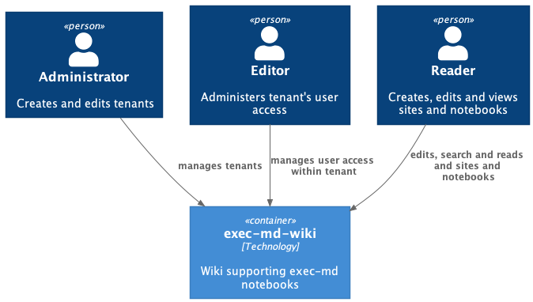

# exec-md-wiki

A wiki using [exec-md](https://github.com/graeme-lockley/exec-md) as the runtime system.

# Features

This implementation will have the following features:

- The runtime system will be [exec-md](https://github.com/graeme-lockley/exec-md)
- The wiki will support [Confluence](https://en.wikipedia.org/wiki/Confluence_(software)) styles sites
- The wiki will support concurrent page editing
- The wiki will be deployable into Azure using Azure's PaaS services

# Context

